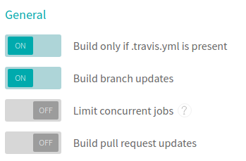
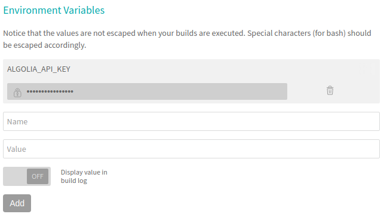

# Deploying on GitHub Pages

GitHub offers free hosting for static websites through its [GitHub Pages][1] feature.
It also has builtin support for Jekyll website. Once [properly configured][2],
every time you push your Jekyll website to GitHub, it will be deployed on
a `username.github.io/reponame` url.

But GitHub will only build your website (`jekyll build`), it will not run other
commands (like `jekyll algolia`), so if you want to update your search results on
each push, you'll have to find another way.

We recommend using [Netlify][3], but if you want to stay hosted on GitHub pages,
this page will explain how to keep your search records in sync with your
deployed website.

## Enabling Travis

[Travis CI][4] is an hosted continuous integration service, and it's free for
open-source projects. It can listen to any changes in your GitHub repository and
run a specific command in response.

We will use it to automatically run `jekyll algolia` every time a new push to
your GitHub Pages is done.

Here are the steps to follow to setup your Travis account for your project:

- Go to [travis-ci.org][5] and open an account
- Click on your avatar and "Profile"
- Find your GitHub repository in the list and activate it

_You should also uncheck the "Build pull request updates" in the options.
This will avoid re-indexing your data every time you receive a pull request._



## Configuring Travis

Now that Travis is enabled, we have to configure it to tell it what to do on
every new push to your repo. This can be done through the Travis UI, but we
recommend doing it through a `.travis.yml` file in your repository. It makes
keeping track of the configuration easier.

```yaml
# .travis.yml
# This file should be at the root of your project
language: ruby
cache: bundler
script:
  - bundle exec jekyll algolia
branches:
  only:
    # Change this to gh-pages if you're deploying using the gh-pages branch
    - master
rvm:
 - 2.4
```

This file will be read by Travis and instruct it to fetch all the dependencies
defined in the `Gemfile` through Bundler. It will then run `bundle exec jekyll
algolia` which will actually index your data.

You might have to edit the `branches.only` value to either `master` or
`gh-pages`, depending on which branch is configured to be deployed in your
GitHub Pages configuration.

## Adding the API Key

The plugin will need your Admin API key to push data. Because you don't want to
expose this key in your repository, you'll have to add `ALGOLIA_API_KEY` as an
environment variable to Travis. You can do that through the UI, in your Travis
Settings page.



## Done

Commit all the changes you made, and then push your repository. Travis will
catch the event and trigger your indexing for you. You can follow the Travis job
execution directly on your Travis dashboard, with a full log.

[1]: https://pages.github.com/
[2]: https://help.github.com/articles/using-jekyll-as-a-static-site-generator-with-github-pages/
[3]: ./netlify.html
[4]: https://travis-ci.org/
[5]: https://travis-ci.org/
